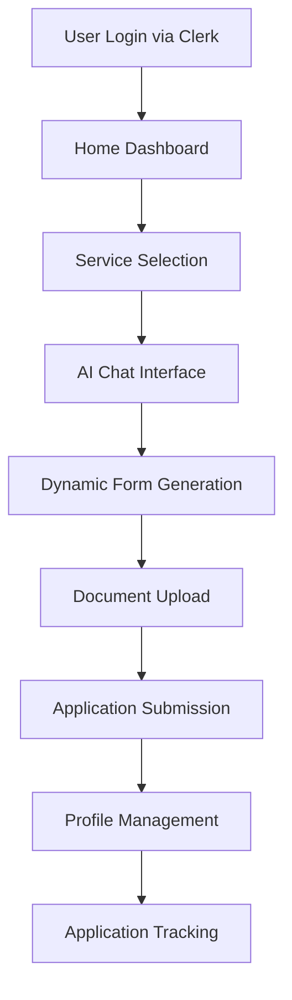

# TAMMAT Frontend Development Guide


## 🚀 Overview

TAMMAT is a comprehensive visa sponsorship platform that enables UAE residents to sponsor their family members. This guide outlines the development approach, architecture, and best practices for building a modern, user-friendly interface with advanced AI-powered features.

## 🎯 Core Features

### Primary Functionality
- **Family Visa Sponsorship**: Complete workflow for sponsoring spouses, parents, and children
- **AI-Powered Chat Interface**: ChatGPT-like experience with predefined prompts and dynamic responses
- **Document Management**: Secure upload, storage, and retrieval system
- **User Profile Management**: Comprehensive user dashboard with all applications and documents
- **Dynamic Form Generation**: Service-specific forms that adapt based on user requirements

### Technical Stack
- **Frontend**: React 19 + TypeScript + Vite
- **Authentication**: Clerk (React)
- **State Management**: Zustand + Redux Toolkit
- **UI Components**: Shadcn UI + Radix UI + TailwindCSS
- **Form Handling**: React Hook Form + Zod validation
- **File Upload**: React Dropzone + Multer (backend)
- **AI Integration**: OpenAI API
- **Database**: MongoDB with Mongoose
- **File Storage**: Local server storage with URL management

## 🏗️ Architecture Overview

### System Flow


### Component Architecture
```
src/
├── components/
│   ├── ChatInterface/          # AI-powered chat system
│   ├── ServiceSelector/        # Service listing and selection
│   ├── DynamicForms/          # Service-specific form generation
│   ├── DocumentUpload/        # File upload and management
│   ├── UserProfile/           # User dashboard and management
│   └── ui/                    # Reusable UI components
├── hooks/
│   ├── useChat.ts             # Chat functionality
│   ├── useDocuments.ts        # Document management
│   ├── useServices.ts         # Service operations
│   └── useUserProfile.ts      # User profile operations
├── services/
│   ├── aiService.ts           # OpenAI integration
│   ├── documentService.ts     # Document operations
│   └── userService.ts         # User operations
└── types/
    ├── chat.types.ts          # Chat-related types
    ├── documents.types.ts     # Document types
    └── services.types.ts      # Service types
```

## 🎨 User Interface Design Principles

### 1. ChatGPT-Like Experience
- **Hero Section**: Clean, focused interface with prominent chat input
- **Predefined Prompts**: Quick action buttons for common scenarios
- **Conversational Flow**: Natural language interaction
- **Progressive Disclosure**: Information revealed as needed

### 2. Service Selection Interface
```typescript
// Example service structure
interface Service {
  id: string;
  name: string;
  description: string;
  category: 'family' | 'business' | 'employment';
  requirements: DocumentRequirement[];
  estimatedTime: string;
  cost: number;
  icon: string;
}
```

### 3. Dynamic Form Generation
- **Conditional Fields**: Show/hide fields based on user responses
- **Document Requirements**: Dynamic document upload sections
- **Validation**: Real-time form validation with helpful error messages
- **Progress Tracking**: Visual progress indicators

## 🔧 Implementation Guidelines

### 1. Authentication & User Management

#### Clerk Integration
```typescript
// src/hooks/useAuth.ts
import { useUser, useAuth } from '@clerk/clerk-react';

export const useAuth = () => {
  const { user, isLoaded } = useUser();
  const { signOut } = useAuth();
  
  return {
    user,
    isLoaded,
    signOut,
    isAuthenticated: !!user,
    userId: user?.id
  };
};
```

#### User Profile Management
```typescript
// src/types/user.types.ts
interface UserProfile {
  id: string;
  clerkId: string;
  personalInfo: PersonalInfo;
  documents: UserDocument[];
  applications: Application[];
  preferences: UserPreferences;
}

interface PersonalInfo {
  fullName: string;
  email: string;
  phone: string;
  nationality: string;
  emiratesId: string;
  residencyVisa: string;
  tradeLicense?: string;
  moa?: string;
  mom?: string;
  establishmentCard?: string;
}
```

### 2. AI Chat Interface

#### Chat Component Structure
```typescript
// src/components/ChatInterface/ChatInterface.tsx
interface ChatMessage {
  id: string;
  type: 'user' | 'assistant' | 'system';
  content: string;
  timestamp: Date;
  metadata?: {
    serviceId?: string;
    formData?: any;
    documents?: string[];
  };
}

interface ChatInterfaceProps {
  serviceId?: string;
  onFormGenerate?: (formData: any) => void;
  onDocumentRequest?: (documents: string[]) => void;
}
```

#### Predefined Prompts
```typescript
// src/constants/chatPrompts.ts
export const FAMILY_VISA_PROMPTS = [
  {
    id: 'spouse-sponsor',
    text: 'I want to sponsor my spouse',
    category: 'family',
    serviceId: 'family-visa-spouse'
  },
  {
    id: 'parents-sponsor',
    text: 'I want to sponsor my parents',
    category: 'family',
    serviceId: 'family-visa-parents'
  },
  {
    id: 'children-sponsor',
    text: 'I want to sponsor my children',
    category: 'family',
    serviceId: 'family-visa-children'
  }
];
```

### 3. Document Management System

#### Document Upload Component
```typescript
// src/components/DocumentUpload/DocumentUpload.tsx
interface DocumentUploadProps {
  requiredDocuments: DocumentRequirement[];
  onUploadComplete: (documents: UploadedDocument[]) => void;
  maxFileSize?: number;
  allowedTypes?: string[];
}

interface DocumentRequirement {
  id: string;
  name: string;
  description: string;
  required: boolean;
  fileTypes: string[];
  maxSize: number;
  category: 'personal' | 'sponsor' | 'sponsored';
}
```

#### File Upload Service
```typescript
// src/services/documentService.ts
export class DocumentService {
  async uploadDocument(file: File, category: string, userId: string): Promise<UploadedDocument> {
    const formData = new FormData();
    formData.append('file', file);
    formData.append('category', category);
    formData.append('userId', userId);
    
    const response = await axios.post('/api/documents/upload', formData, {
      headers: { 'Content-Type': 'multipart/form-data' }
    });
    
    return response.data;
  }
  
  async getUserDocuments(userId: string): Promise<UserDocument[]> {
    const response = await axios.get(`/api/documents/user/${userId}`);
    return response.data;
  }
}
```

### 4. Dynamic Form Generation

#### Form Builder
```typescript
// src/components/DynamicForms/FormBuilder.tsx
interface FormBuilderProps {
  serviceId: string;
  userProfile: UserProfile;
  onFormSubmit: (formData: any) => void;
}

interface FormField {
  id: string;
  type: 'text' | 'email' | 'phone' | 'select' | 'date' | 'file' | 'textarea';
  label: string;
  required: boolean;
  validation?: ValidationRule[];
  conditional?: ConditionalLogic;
  options?: SelectOption[];
}
```

#### Conditional Logic
```typescript
// src/utils/formLogic.ts
interface ConditionalLogic {
  field: string;
  operator: 'equals' | 'not_equals' | 'contains' | 'greater_than';
  value: any;
  action: 'show' | 'hide' | 'require' | 'optional';
}

export const evaluateCondition = (
  condition: ConditionalLogic,
  formData: Record<string, any>
): boolean => {
  const fieldValue = formData[condition.field];
  
  switch (condition.operator) {
    case 'equals':
      return fieldValue === condition.value;
    case 'not_equals':
      return fieldValue !== condition.value;
    case 'contains':
      return String(fieldValue).includes(condition.value);
    case 'greater_than':
      return Number(fieldValue) > Number(condition.value);
    default:
      return false;
  }
};
```

### 5. Service Management

#### Service Configuration
```typescript
// src/config/services.ts
export const FAMILY_VISA_SERVICES = {
  'family-visa-spouse': {
    id: 'family-visa-spouse',
    name: 'Spouse Family Visa',
    description: 'Sponsor your spouse for UAE family visa',
    requirements: [
      'emirates-id',
      'residency-visa',
      'trade-license',
      'moa',
      'mom',
      'establishment-card',
      'marriage-certificate',
      'spouse-passport',
      'spouse-photos'
    ],
    estimatedTime: '15-20 business days',
    cost: 2500,
    category: 'family'
  },
  'family-visa-parents': {
    id: 'family-visa-parents',
    name: 'Parents Family Visa',
    description: 'Sponsor your parents for UAE family visa',
    requirements: [
      'emirates-id',
      'residency-visa',
      'trade-license',
      'moa',
      'mom',
      'establishment-card',
      'birth-certificate',
      'parents-passports',
      'parents-photos'
    ],
    estimatedTime: '20-25 business days',
    cost: 3000,
    category: 'family'
  }
};
```

## 📱 Component Implementation Examples

### 1. Hero Section with Chat Interface
```typescript
// src/components/HomePage/HeroSection.tsx
export const HeroSection: React.FC = () => {
  const [selectedPrompt, setSelectedPrompt] = useState<string>('');
  const [chatInput, setChatInput] = useState<string>('');
  
  return (
    <section className="min-h-screen bg-gradient-to-br from-blue-50 to-indigo-100 flex items-center justify-center">
      <div className="max-w-6xl mx-auto px-6 text-center">
        <h1 className="text-5xl font-bold text-gray-900 mb-6">
          Sponsor Your Family to UAE
        </h1>
        <p className="text-xl text-gray-600 mb-12 max-w-3xl mx-auto">
          Get expert guidance and complete your visa sponsorship application with our AI-powered platform
        </p>
        
        {/* Predefined Prompts */}
        <div className="flex flex-wrap justify-center gap-4 mb-8">
          {FAMILY_VISA_PROMPTS.map((prompt) => (
            <button
              key={prompt.id}
              onClick={() => setSelectedPrompt(prompt.text)}
              className="px-6 py-3 bg-white rounded-full shadow-lg hover:shadow-xl transition-all duration-200 border border-gray-200 hover:border-blue-300"
            >
              {prompt.text}
            </button>
          ))}
        </div>
        
        {/* Chat Input */}
        <div className="max-w-2xl mx-auto">
          <div className="relative">
            <input
              type="text"
              value={chatInput}
              onChange={(e) => setChatInput(e.target.value)}
              placeholder="Ask me about visa sponsorship..."
              className="w-full px-6 py-4 text-lg border-2 border-gray-300 rounded-full focus:border-blue-500 focus:outline-none shadow-lg"
            />
            <button className="absolute right-2 top-2 bg-blue-600 text-white p-2 rounded-full hover:bg-blue-700 transition-colors">
              <SendIcon className="w-5 h-5" />
            </button>
          </div>
        </div>
      </div>
    </section>
  );
};
```

### 2. Service Selection Grid
```typescript
// src/components/ServiceSelector/ServiceGrid.tsx
export const ServiceGrid: React.FC = () => {
  const { services } = useServices();
  const navigate = useNavigate();
  
  const handleServiceSelect = (serviceId: string) => {
    navigate(`/service/${serviceId}`);
  };
  
  return (
    <div className="grid grid-cols-1 md:grid-cols-2 lg:grid-cols-3 gap-6 p-6">
      {services.map((service) => (
        <div
          key={service.id}
          onClick={() => handleServiceSelect(service.id)}
          className="bg-white rounded-xl shadow-lg hover:shadow-xl transition-all duration-200 cursor-pointer p-6 border border-gray-200 hover:border-blue-300"
        >
          <div className="flex items-center mb-4">
            <div className="w-12 h-12 bg-blue-100 rounded-lg flex items-center justify-center mr-4">
              <span className="text-2xl">{service.icon}</span>
            </div>
            <div>
              <h3 className="text-lg font-semibold text-gray-900">{service.name}</h3>
              <p className="text-sm text-gray-500">{service.category}</p>
            </div>
          </div>
          
          <p className="text-gray-600 mb-4">{service.description}</p>
          
          <div className="flex justify-between items-center">
            <span className="text-sm text-gray-500">Est. {service.estimatedTime}</span>
            <span className="text-lg font-semibold text-blue-600">AED {service.cost}</span>
          </div>
        </div>
      ))}
    </div>
  );
};
```

### 3. Document Upload Component
```typescript
// src/components/DocumentUpload/DocumentUploader.tsx
export const DocumentUploader: React.FC<DocumentUploadProps> = ({
  requiredDocuments,
  onUploadComplete,
  maxFileSize = 10 * 1024 * 1024, // 10MB
  allowedTypes = ['image/*', 'application/pdf']
}) => {
  const [uploadedDocs, setUploadedDocs] = useState<Record<string, File>>({});
  const [uploading, setUploading] = useState<Record<string, boolean>>({});
  
  const onDrop = useCallback((acceptedFiles: File[], rejectedFiles: any[], event: any) => {
    const { name } = event.target.dataset;
    if (acceptedFiles.length > 0) {
      setUploadedDocs(prev => ({ ...prev, [name]: acceptedFiles[0] }));
    }
  }, []);
  
  const { getRootProps, getInputProps, isDragActive } = useDropzone({
    onDrop,
    accept: allowedTypes.reduce((acc, type) => ({ ...acc, [type]: [] }), {}),
    maxSize: maxFileSize
  });
  
  return (
    <div className="space-y-6">
      {requiredDocuments.map((doc) => (
        <div key={doc.id} className="border border-gray-200 rounded-lg p-4">
          <div className="flex items-center justify-between mb-3">
            <div>
              <h4 className="font-medium text-gray-900">{doc.name}</h4>
              <p className="text-sm text-gray-500">{doc.description}</p>
            </div>
            {doc.required && (
              <span className="text-red-500 text-sm font-medium">Required</span>
            )}
          </div>
          
          {uploadedDocs[doc.id] ? (
            <div className="flex items-center justify-between p-3 bg-green-50 border border-green-200 rounded-md">
              <div className="flex items-center">
                <CheckCircleIcon className="w-5 h-5 text-green-600 mr-2" />
                <span className="text-green-800">{uploadedDocs[doc.id].name}</span>
              </div>
              <button
                onClick={() => setUploadedDocs(prev => {
                  const newDocs = { ...prev };
                  delete newDocs[doc.id];
                  return newDocs;
                })}
                className="text-red-600 hover:text-red-800"
              >
                Remove
              </button>
            </div>
          ) : (
            <div
              {...getRootProps()}
              data-name={doc.id}
              className={`border-2 border-dashed rounded-lg p-6 text-center cursor-pointer transition-colors ${
                isDragActive ? 'border-blue-400 bg-blue-50' : 'border-gray-300 hover:border-gray-400'
              }`}
            >
              <input {...getInputProps()} data-name={doc.id} />
              <UploadIcon className="w-8 h-8 text-gray-400 mx-auto mb-2" />
              <p className="text-gray-600">
                {isDragActive ? 'Drop files here' : 'Drag & drop files here, or click to select'}
              </p>
              <p className="text-sm text-gray-500 mt-1">
                {doc.fileTypes.join(', ')} • Max {Math.round(maxFileSize / 1024 / 1024)}MB
              </p>
            </div>
          )}
        </div>
      ))}
      
      <button
        onClick={() => onUploadComplete(Object.values(uploadedDocs))}
        disabled={Object.keys(uploadedDocs).length < requiredDocuments.filter(d => d.required).length}
        className="w-full bg-blue-600 text-white py-3 px-6 rounded-lg font-medium hover:bg-blue-700 disabled:bg-gray-300 disabled:cursor-not-allowed transition-colors"
      >
        Continue with Application
      </button>
    </div>
  );
};
```

## 🔄 State Management

### Zustand Store for User Profile
```typescript
// src/store/userProfileStore.ts
interface UserProfileState {
  profile: UserProfile | null;
  documents: UserDocument[];
  applications: Application[];
  isLoading: boolean;
  error: string | null;
  
  // Actions
  fetchProfile: (userId: string) => Promise<void>;
  updateProfile: (updates: Partial<UserProfile>) => Promise<void>;
  uploadDocument: (file: File, category: string) => Promise<void>;
  createApplication: (serviceId: string, formData: any) => Promise<void>;
  fetchApplications: (userId: string) => Promise<void>;
}

export const useUserProfileStore = create<UserProfileState>((set, get) => ({
  profile: null,
  documents: [],
  applications: [],
  isLoading: false,
  error: null,
  
  fetchProfile: async (userId: string) => {
    set({ isLoading: true, error: null });
    try {
      const profile = await userService.getProfile(userId);
      const documents = await documentService.getUserDocuments(userId);
      const applications = await applicationService.getUserApplications(userId);
      
      set({ profile, documents, applications, isLoading: false });
    } catch (error) {
      set({ error: error.message, isLoading: false });
    }
  },
  
  updateProfile: async (updates: Partial<UserProfile>) => {
    set({ isLoading: true, error: null });
    try {
      const updatedProfile = await userService.updateProfile(updates);
      set({ profile: updatedProfile, isLoading: false });
    } catch (error) {
      set({ error: error.message, isLoading: false });
    }
  },
  
  uploadDocument: async (file: File, category: string) => {
    set({ isLoading: true, error: null });
    try {
      const document = await documentService.uploadDocument(file, category, get().profile?.id!);
      set(state => ({
        documents: [...state.documents, document],
        isLoading: false
      }));
    } catch (error) {
      set({ error: error.message, isLoading: false });
    }
  },
  
  createApplication: async (serviceId: string, formData: any) => {
    set({ isLoading: true, error: null });
    try {
      const application = await applicationService.create(serviceId, formData, get().profile?.id!);
      set(state => ({
        applications: [...state.applications, application],
        isLoading: false
      }));
    } catch (error) {
      set({ error: error.message, isLoading: false });
    }
  },
  
  fetchApplications: async (userId: string) => {
    set({ isLoading: true, error: null });
    try {
      const applications = await applicationService.getUserApplications(userId);
      set({ applications, isLoading: false });
    } catch (error) {
      set({ error: error.message, isLoading: false });
    }
  }
}));
```

## 🚀 Development Workflow

### 1. Project Setup
```bash
# Clone the repository
git clone <repository-url>
cd tammat-frontend

# Install dependencies
npm install

# Set up environment variables
cp .env.example .env.local
# Configure Clerk, OpenAI, and other API keys

# Start development server
npm run dev
```

### 2. Development Guidelines
- **Component Structure**: Use functional components with TypeScript
- **State Management**: Prefer Zustand for local state, Redux for global app state
- **Styling**: Use TailwindCSS with custom component variants
- **Form Handling**: React Hook Form with Zod validation
- **Error Handling**: Implement comprehensive error boundaries and user feedback
- **Testing**: Write unit tests for critical components and integration tests for user flows

### 3. Code Quality Standards
- **TypeScript**: Strict mode enabled, proper type definitions
- **ESLint**: Configured with React and TypeScript rules
- **Prettier**: Consistent code formatting
- **Git Hooks**: Pre-commit hooks for linting and formatting
- **Component Documentation**: JSDoc comments for complex components

## 📊 Performance Optimization

### 1. Code Splitting
```typescript
// src/AppRouter.tsx
import { lazy, Suspense } from 'react';

const HomePage = lazy(() => import('./pages/Home/HomePage'));
const ServicePage = lazy(() => import('./pages/Services/ServicePage'));
const ProfilePage = lazy(() => import('./pages/Profile/ProfilePage'));

// Wrap routes with Suspense
<Suspense fallback={<LoadingSpinner />}>
  <Routes>
    <Route path="/" element={<HomePage />} />
    <Route path="/service/:id" element={<ServicePage />} />
    <Route path="/profile" element={<ProfilePage />} />
  </Routes>
</Suspense>
```

### 2. Image Optimization
```typescript
// src/components/ui/OptimizedImage.tsx
export const OptimizedImage: React.FC<ImageProps> = ({ src, alt, ...props }) => {
  const [isLoaded, setIsLoaded] = useState(false);
  
  return (
    <div className="relative overflow-hidden">
       setIsLoaded(true)}
        className={`transition-opacity duration-300 ${
          isLoaded ? 'opacity-100' : 'opacity-0'
        }`}
        {...props}
      />
      {!isLoaded && (
        <div className="absolute inset-0 bg-gray-200 animate-pulse" />
      )}
    </div>
  );
};
```

### 3. API Caching
```typescript
// src/hooks/useServices.ts
import { useQuery } from '@tanstack/react-query';

export const useServices = () => {
  const { data: services, isLoading, error } = useQuery({
    queryKey: ['services'],
    queryFn: serviceService.getAll,
    staleTime: 5 * 60 * 1000, // 5 minutes
    cacheTime: 10 * 60 * 1000, // 10 minutes
  });
  
  return { services: services || [], isLoading, error };
};
```

## 🔒 Security Considerations

### 1. File Upload Security
- File type validation
- File size limits
- Virus scanning (optional)
- Secure file storage with signed URLs

### 2. Authentication & Authorization
- Clerk integration for secure authentication
- Role-based access control
- Session management
- API endpoint protection

### 3. Data Protection
- Input sanitization
- XSS prevention
- CSRF protection
- Secure API communication

## 🧪 Testing Strategy

### 1. Unit Tests
```typescript
// src/components/__tests__/DocumentUploader.test.tsx
import { render, screen, fireEvent } from '@testing-library/react';
import { DocumentUploader } from '../DocumentUploader';

describe('DocumentUploader', () => {
  it('should display required documents', () => {
    const mockDocuments = [
      { id: '1', name: 'Emirates ID', required: true, description: 'Upload your Emirates ID' }
    ];
    
    render(<DocumentUploader requiredDocuments={mockDocuments} onUploadComplete={jest.fn()} />);
    
    expect(screen.getByText('Emirates ID')).toBeInTheDocument();
    expect(screen.getByText('Required')).toBeInTheDocument();
  });
  
  it('should handle file upload', () => {
    const mockOnUploadComplete = jest.fn();
    const mockDocuments = [
      { id: '1', name: 'Emirates ID', required: true, description: 'Upload your Emirates ID' }
    ];
    
    render(<DocumentUploader requiredDocuments={mockDocuments} onUploadComplete={mockOnUploadComplete} />);
    
    const file = new File(['test'], 'test.pdf', { type: 'application/pdf' });
    const dropzone = screen.getByText('Drag & drop files here, or click to select');
    
    fireEvent.drop(dropzone, { dataTransfer: { files: [file] } });
    
    expect(screen.getByText('test.pdf')).toBeInTheDocument();
  });
});
```

### 2. Integration Tests
- User authentication flow
- Document upload process
- Form submission workflow
- Service selection and navigation

### 3. E2E Tests
- Complete visa application process
- User profile management
- Document management workflow

## 🚀 Deployment

### 1. Build Configuration
```typescript
// vite.config.ts
import { defineConfig } from 'vite';
import react from '@vitejs/plugin-react';
import { resolve } from 'path';

export default defineConfig({
  plugins: [react()],
  resolve: {
    alias: {
      '@': resolve(__dirname, 'src'),
    },
  },
  build: {
    outDir: 'dist',
    sourcemap: true,
    rollupOptions: {
      output: {
        manualChunks: {
          vendor: ['react', 'react-dom'],
          ui: ['@radix-ui/react-dialog', '@radix-ui/react-dropdown-menu'],
        },
      },
    },
  },
});
```

### 2. Environment Configuration
```typescript
// src/config/environment.ts
export const config = {
  development: {
    apiUrl: 'http://localhost:3001',
    clerkPublishableKey: process.env.VITE_CLERK_PUBLISHABLE_KEY,
    openaiApiKey: process.env.VITE_OPENAI_API_KEY,
  },
  production: {
    apiUrl: process.env.VITE_API_URL,
    clerkPublishableKey: process.env.VITE_CLERK_PUBLISHABLE_KEY,
    openaiApiKey: process.env.VITE_OPENAI_API_KEY,
  },
}[process.env.NODE_ENV || 'development'];
```

## 📚 Additional Resources

### Documentation
- [React Documentation](https://react.dev/)
- [TypeScript Handbook](https://www.typescriptlang.org/docs/)
- [TailwindCSS Documentation](https://tailwindcss.com/docs)
- [Clerk Documentation](https://clerk.com/docs)
- [Shadcn UI Components](https://ui.shadcn.com/)

### Best Practices
- [React Best Practices](https://react.dev/learn)
- [TypeScript Best Practices](https://github.com/typescript-eslint/typescript-eslint)
- [Frontend Performance](https://web.dev/performance/)
- [Accessibility Guidelines](https://www.w3.org/WAI/WCAG21/quickref/)

## 🤝 Contributing

1. Fork the repository
2. Create a feature branch (`git checkout -b feature/amazing-feature`)
3. Commit your changes (`git commit -m 'Add some amazing feature'`)
4. Push to the branch (`git push origin feature/amazing-feature`)
5. Open a Pull Request

## 📄 License

This project is licensed under the MIT License - see the [LICENSE](LICENSE) file for details.

---

**Happy Coding! 🚀**

For questions or support, please reach out to the development team or create an issue in the repository. 